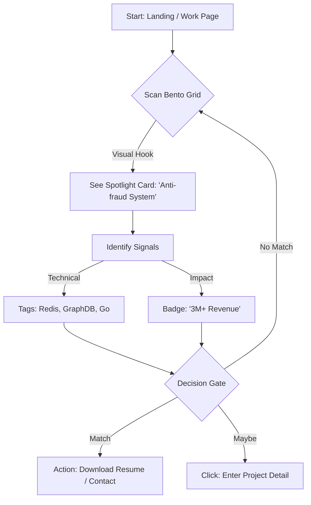
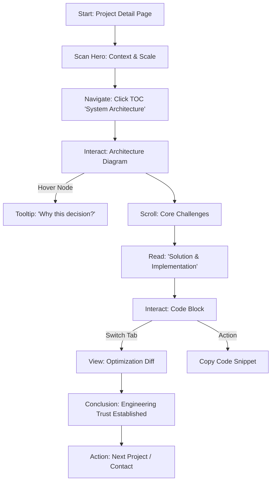

# UX Design Specification: KInfoGit

## 1. Design Overview

### Core Design Philosophy
*To be defined in discovery phase*

### Key User Experience Goals
*To be defined in discovery phase*

### Brand & Visual Identity
*To be defined in discovery phase*

---

## Executive Summary

### Project Vision
KInfoGit 1.0 旨在打造一个工程化、结构化的个人数字档案。它超越了传统的视觉流作品集，通过严谨的信息架构和交互设计，直接体现所有者在全栈开发与产品思维上的系统性能力。核心目标是让 HR 在 10 秒内抓取重点，让技术面试官在深读中认可专业度。

### Target Users
*   **HR / 招聘专员**: 极速浏览者。关注“他是谁”、“做过什么大项目”、“技能是否匹配”。需要一眼即得的标签 and 清晰的列表。
*   **技术面试官 / 架构师**: 深度阅读者。关注项目背后的挑战、架构决策、技术难点与解决方案。需要结构化、有深度的内容呈现。

### Key Design Challenges
*   **信息层级的平衡**: 既要满足 HR 的快速扫描（标签、摘要），又要满足面试官的深度阅读（架构图、代码块、长文），如何在同一套 UI 中自然过渡？
*   **静态数据的灵活性**: 在没有后端 CMS 的情况下，如何设计一种灵活的 JSON/MDX 数据结构与 UI 组件，使得维护新项目既简单又能保证展示的丰富性？
*   **工程感的视觉化**: 如何不通过花哨的动效，而是通过布局、排版和组件细节（如代码高亮、架构图展示组件）来传递“工程师的专业感”？

### Design Opportunities
*   **"渐进式揭示"的项目卡片**: 设计一种支持“预览 -> 展开 -> 详情”的卡片交互，让不同受众各取所需。
*   **结构化的技术栈展示**: 不只是列出 React/Node.js 图标，而是结合具体业务场景（如“使用 Redis 解决高并发”）展示技术应用。
*   **沉浸式阅读体验**: 为项目详情页设计类似技术文档或 Case Study 的阅读体验，增强专业可信度。

---

## 2. Core User Experience

### 2.1 Defining Experience
**"The Architectural Deep Dive" (架构深度潜入)**
KInfoGit 的定义性交互在于用户从浏览宏观的“项目卡片”到沉浸入微观的“架构细节”的那个转换瞬间。用户不仅是点击一个链接，而是仿佛打开了一个 IDE 的文件夹，瞬间从“招聘视角”切换到“工程师视角”。

### 2.2 User Mental Model
*   **Current Model**: HR/面试官习惯了 PDF 简历的枯燥罗列，或 GitHub Readme 的信息过载。
*   **Target Model**: 我们要构建的心理模型是 **"Interactive Case Study" (交互式案例分析)**。就像在阅读一篇高质量的技术博客或观看一场精炼的技术演讲，既有高层概览（Slide），又有底层代码（Demo）。

### 2.3 Success Criteria
*   **Seamless Transition**: 从列表页到详情页的转场必须无感知加载（<100ms），且伴随轻微的元素共享动画（Shared Element Transition），维持上下文连续性。
*   **Scannable Depth**: 详情页必须支持两种阅读模式——HR 的 "F型扫描"（看标题、加粗字、图表）和 工程师的 "线性阅读"（看代码逻辑、架构推演）。
*   **Interactive Proof**: 每一个技术亮点（如“高性能”）都必须有对应的交互式证据（如“点击查看 Benchmark 数据”或“高亮优化代码段”）。

---

## 3. Desired Emotional Response

### Primary Emotional Goals
*   **Professional Trust (专业信任)**: 这是最核心的目标。通过严谨的排版、清晰的逻辑和详实的数据，让 HR 和面试官在潜意识里建立起“此人靠谱”的信任感。
*   **Intellectual Delight (智力愉悦)**: 当复杂的技术难点被结构化、可视化地清晰呈现时，给技术读者带来一种“读懂了”的快感和对作者能力的认同。

---

## 4. UX Pattern Analysis & Inspiration

### Inspiring Products Analysis
**Linear (App & Landing Page)**
*   **Core Appeal**: "Engineered for speed, built for focus." Linear 重新定义了开发者工具的美学——它不是冷冰冰的，而是充满质感、速度感和精确感的。
*   **Key UX Patterns**:
    *   **Magic Borders (流光边框)**: 使用细腻的渐变边框和光晕效果（Glow）来引导视线，而不是粗暴的弹窗或高亮背景。
    *   **Micro-interactions**: 极度细腻的 Hover 态，悬停时卡片微微上浮并点亮，给用户极强的“可交互”心理暗示。
    *   **Bento Grid**: 使用网格布局展示不同维度的信息，既整齐又富有变化。

---

## 5. Design System Foundation

### 5.1 Design System Choice
**Tailwind Native + Headless Components (Inspired by shadcn/ui)**

### Rationale for Selection
*   **性能极致化**: 静态导出 (SSG) 场景下，避免大型组件库带来的 JS Bundle 负担。
*   **视觉高精度**: Linear 风格的细腻边框、流光效果。

---

## 6. Visual Design Foundation

### Color System
*   **Base Palette**: 采用深邃的“暗核”调色板。
*   **Accent**: `Pink-to-Violet` 渐变 + `Linear Blue (#5e6ad2)`。

### Typography System
*   **Primary Typeface**: Inter / System Sans-serif。
*   **Technical Typeface**: JetBrains Mono / Roboto Mono (用于技术栈、日期、代码)。

---

## 7. Design Direction Decision

### Chosen Direction
**"The Hybrid Professional" (混合专业方案)**
我们将列表页定位于 **Bento Grid** 布局，利用不等宽卡片创造节奏感，并展示项目的关键指标（Impact）和技术栈（Tags）。详情页切换至 **Engineering Doc** 模式，采用双栏/三栏结构，左侧为结构化叙事，右侧为关联的代码段或交互式架构图。

### Design Rationale
*   **满足双重受众**: Bento Grid 帮助 HR 在 10 秒内看到成果；工程文档流帮助面试官在 5 分钟内认可深度。
*   **视觉连贯性**: 通过统一的深色调背景、Linear 风格的聚光灯边框和等宽字体（JetBrains Mono）贯穿始终。
*   **技术导向**: 详情页的设计直接模仿高质量的技术文档（如 Stripe/Linear），建立起一种“原生”的专业感。

---

## 8. User Journey Flows

### Journey 1: HR - "Rapid Screening" (10s Decision)
**User Goal**: Quickly identify if the candidate has relevant experience (tech stack, scale, impact) to justify further contact.
**Optimized Flow**:

### Journey 2: Technical Interviewer - "The Architectural Deep Dive"
**User Goal**: Verify the candidate's engineering depth.
**Optimized Flow**:

### Journey Patterns
*   **"Hover-to-Reveal"**: 在 HR 旅程中，通过悬停卡片展示更多元数据。
*   **"Context-Linked Navigation"**: 在面试官旅程中，右侧的 TOC 不仅是目录，更是阅读进度的指示器。
*   **"Evidence-First"**: 每一个宣称的“成就”（Impact）在详情页中都有对应的“证据”（架构图或代码）作为支撑。

### Flow Optimization Principles
*   **Zero-Click Value**: HR 在不点击任何内容的情况下（仅靠列表页信息），就应该能完成 80% 的筛选工作。
*   **Progressive Depth**: 面试官的阅读体验应该是“层层递进”的——从宏观架构到微观代码。

---

## 9. Component Strategy

### Custom Components

#### 1. Spotlight Card (聚光灯项目卡片)
*   **Anatomy**: 透明/半透明背景 + 1px Border + 动态 Canvas/SVG 光晕层。
*   **Interaction**: 鼠标移动触发 `radial-gradient` 中心点偏移。

#### 2. Interactive Tech Stack (交互式技术栈)
*   **Rationale**: 强调技术不是简单的堆砌，而是服务于具体的业务场景。

#### 3. Sticky TOC (粘性目录)
*   **Features**: 自动解析 H2/H3 标签，配合 `IntersectionObserver` 实现滚动同步。

#### 4. Engineering Diagram (工程架构图)
*   **Interaction**: 点击特定的“节点”，正文自动滚动到对应的解析部分。

---

## 10. UX Consistency Patterns

### Button Hierarchy
*   **Primary**: `Linear Blue (#5e6ad2)` 背景，点击反馈。
*   **Secondary**: `neutral-900` 背景 + 1px `neutral-800` 描边。

### Feedback Patterns
*   **Active Hover (Spotlight)**: 全站统一的鼠标跟随光晕效果。
*   **Toast / Tooltip**: 代码复制后弹出简短提示。

### Navigation Patterns
*   **Sticky Header**: 向下滚动时增加 `backdrop-blur` 磨砂效果。
*   **TOC Sync**: 目录实时追踪滚动位置并高亮。

---

## 11. Responsive Design & Accessibility

### Responsive Strategy
*   **Desktop First**: 优先优化大屏体验，Work 列表为 3 列 Bento，详情为双栏。
*   **Tablet**: Work 列表为 2 列，详情为单列 + 浮动 TOC。
*   **Mobile**: Work 列表为单列，详情为线性流。

### Breakpoint Strategy
*   Standard Tailwind breakpoints: `sm`, `md`, `lg`, `xl`.

### Accessibility Strategy
*   **Visual Contrast**: 确保正文对比度 >= 4.5:1。
*   **Reduced Motion**: 尊重系统设置，关闭非必要动效。

### Implementation Guidelines
*   Use `rem` for spacing and fonts.
*   Ensure all custom components are keyboard navigable.

---

## 3. Interface Design Patterns

### Core Layouts
*To be defined in detailed design phase*

### Interactive Elements
*To be defined in detailed design phase*

### Responsive Behavior
*To be defined in detailed design phase*

---

## 4. Accessibility & Inclusion

### Accessibility Standards
*To be defined in detailed design phase*

### Inclusive Design Considerations
*To be defined in detailed design phase*

---

## 5. Design System Integration

### Component Library
*To be defined in detailed design phase*

### Design Tokens
*To be defined in detailed design phase*