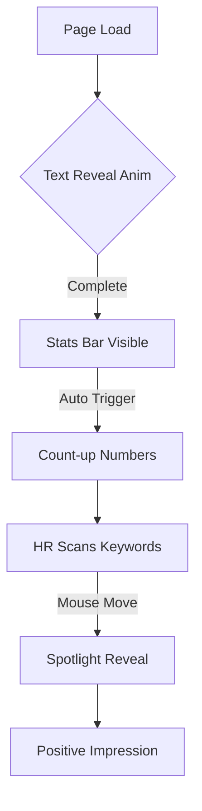
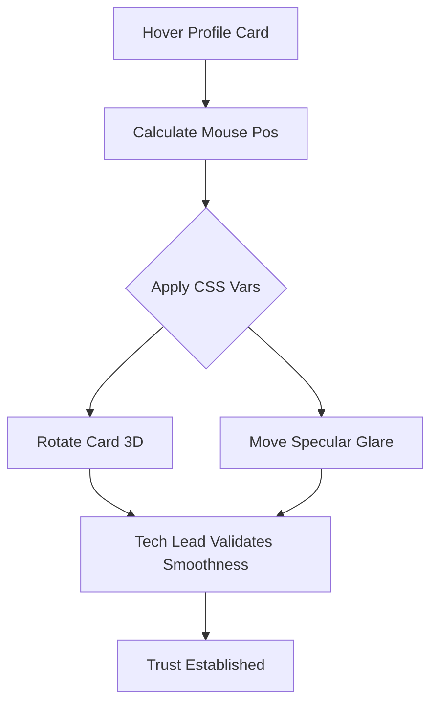

# UX Design Specification - KInfoGit

## 1. Design Overview

### Executive Summary
KInfoGit is a personal portfolio website built with Next.js static export. The current iteration (v1.0) aims to complete the core structure and provide a professional, structured presentation of projects and skills. This UX design specification focuses on elevating the "More About Me" section from a static information block to a creative, interactive highlight that engages visitors immediately.

### Key Design Principles
*   **Creative Interaction:** Use modern, high-quality animations (React Bits style) to capture attention without overwhelming the content.
*   **Professional Polish:** Maintain a balance between creativity and professional clarity. The visual flair should enhance, not distract from, the personal brand.
*   **Performance:** Ensure animations are lightweight and performant on both desktop and mobile.
*   **Structured Presentation:** Even within creative components, information must remain clear and accessible.

## 2. Core User Flows (UX Discovery)

*(To be populated in Step 2)*

## 3. Visual System

*(To be populated in subsequent steps)*

## 4. Component Patterns

*(To be populated in subsequent steps)*

## 5. Page Specifications

*(To be populated in subsequent steps)*
## 2. Project Understanding (UX Discovery)

### Project Vision
KInfoGit will evolve from a basic portfolio structure to a professional digital dossier with high aesthetic and interactive standards. By integrating cinematic interactions (Text Reveal), high-performance visual effects (Spotlight), and physical material simulation (3D Glare Card) into the "More About Me" section, we aim to create an immediate "Wow" factor that showcases engineering capability without sacrificing professional clarity.

### Target Users
*   **HR / Recruiters:** Need to form an instant impression of "exceptional taste and frontend engineering skill" within seconds.
*   **Tech Leads / Interviewers:** Look for attention to detail, performance optimization in animations, and mastery of modern "Design Engineering" trends.

### Key Design Challenges
*   **Performance vs. Visuals:** Implementing rich interactions (React Bits style) within a Next.js Static Export (SSG) environment while maintaining 100/100 Lighthouse scores.
*   **Visual Cohesion:** Integrating high-energy visual styles (cyber/fluid) into the existing clean, structured professional layout without creating jarring contrast.
*   **Mobile Adaptation:** Translating mouse-hover-dependent effects (like Spotlight/Tilt) into meaningful touch interactions or elegant fallbacks for mobile users.

### Design Opportunities
*   **Exploratory Storytelling:** Use the **Spotlight Effect** to guide user attention and make discovering skills/traits feel like an active exploration.
*   **Living Data:** Transform static metrics into **Count-up Animations**, giving a sense of momentum and growth to career statistics.
*   **Physicality & Depth:** Upgrade standard 3D tilts to include **Specular Glare** and glass material properties, adding depth and a premium feel to the UI.

## Core User Experience

### Defining Experience
The core experience is **Active Exploration**. Instead of passively reading a static bio, users engage with the "More About Me" section through mouse movement and interaction. The interface responds with physics-based feedback (light, depth, motion), transforming the consumption of information into a discovery process.

### Platform Strategy
*   **Desktop (Primary):** Heavily leverages mouse hover events for Spotlight, 3D Tilt, and Glare effects to create a highly immersive tactical feel.
*   **Mobile (Secondary):** Adapts hover-dependent effects into automated ambient animations (e.g., Spotlight breathing automatically) or simplified touch interactions to ensure the "Wow" factor remains without broken UX.

### Effortless Interactions
*   **Self-Revealing Affordances:** Interactive elements (cards, stats) use ambient light hints to suggest interactivity without needing "Click Here" labels.
*   **Auto-Triggered Delight:** Animations like the Count-up Stats and Text Reveal trigger automatically upon scrolling into view, rewarding the user simply for browsing.

### Critical Success Moments
*   **The "Glossy" Moment:** When a recruiter hovers over the profile card and sees the realistic specular glare follow their mouse, confirming high-end engineering capability.
*   **The Cinematic Entrance:** The moment the section loads and the "I'm Kylin..." text reveals itself with a high-quality blur effect, establishing a premium personal brand.

### Experience Principles
1.  **Physics-First:** Interactions mimic physical world properties (lighting, depth, inertia) to feel grounded and high-quality.
2.  **Discovery over Display:** Information is revealed and highlighted through user interaction rather than being statically presented.
3.  **Performance as a Feature:** Complex visuals must run at 60fps; lag or jitter immediately breaks the illusion of quality.

## Desired Emotional Response

### Primary Emotional Goals
*   **Awe (惊叹):** Immediate visual impact upon load (Text Reveal) that signals high production value.
*   **Trust (信任):** Precision in motion and layout conveys engineering reliability; "if the site is this polished, the code must be too."
*   **Curiosity (好奇):** Interactive lighting and depth effects invite the user to play and explore rather than just scan.

### Emotional Journey Mapping
1.  **Entry (Discovery):** "Wow, this feels premium." (Trigger: Text Reveal, Glare entrance)
2.  **Action (Interaction):** "Oh, it responds to me!" (Trigger: Mouse tilt, Spotlight)
3.  **Exit (Retention):** "I need to remember this candidate." (Trigger: Unique visual imprint)

### Micro-Emotions
*   **Delight:** The subtle feedback when hovering over a stat icon.
*   **Confidence:** The smooth, jank-free 60fps performance of the animations.

### Emotional Design Principles
1.  **Premium but Approachable:** Use soft lighting and fluid motion to make the "high-tech" feel welcoming, not cold.
2.  **Intelligent Responsiveness:** The UI should feel "alive" and aware of the user's presence.
3.  **Restrained Wow:** Special effects serve the content, enhancing readability and focus rather than distracting from it.

## UX Pattern Analysis & Inspiration

### Inspiring Products Analysis
*   **React Bits / Aceternity UI:** Primary inspiration for high-fidelity animations. Key strength: "copy-paste" component architecture that keeps performance high by avoiding heavy npm packages.
*   **Linear / Vercel:** Benchmark for professional minimalism. Uses subtle border-light effects and perfect typography to convey "enterprise-grade" quality.
*   **Apple Product Pages:** Masters of scroll-based storytelling where elements animate precisely as the user discovers them.

### Transferable UX Patterns
*   **Spotlight / Hover Reveal:** Information or borders are revealed only when the user's "attention" (mouse) is present, maintaining a clean aesthetic while rewarding exploration.
*   **Bento Grid Layout:** Organizing heterogeneous content (photo, stats, intro) into a structured grid that adapts beautifully to different screen sizes.
*   **Staggered Entrance:** Sequenced animations (Text Reveal followed by Card Entrance) to control the flow of user perception.

### Anti-Patterns to Avoid
*   **The Loading Spinner Trap:** Heavy animations that require a pre-loader. KInfoGit must be instant.
*   **Scroll-Jacking:** Interfering with native browser scrolling physics, which often results in a "laggy" or frustrating feel.
*   **Mystery Meat Navigation:** Over-animating to the point where buttons or text are no longer recognizable as interactive elements.

### Design Inspiration Strategy
*   **Adopt:** Local component implementation of Aceternity-style "Spotlight" and "Text Reveal" for maximum control and performance.
*   **Adapt:** Bento Grid principles for the "More About Me" layout to provide a modern, organized visual structure.
*   **Avoid:** Large external animation libraries (like Three.js or heavy GSAP plugins) unless absolutely necessary for a core feature.

## Design System Foundation

### 1.1 Design System Choice
**Hybrid Utility-First System:** Built on Tailwind CSS, leveraging the "Source-available" component model (inspired by Shadcn/UI and Aceternity UI).

### Rationale for Selection
*   **Performance:** Copy-pasting optimized component code instead of installing heavy npm packages minimizes bundle size for static export.
*   **Unlimited Customization:** Direct access to animation logic (Framer Motion) and styles (Tailwind) allows for pixel-perfect alignment with React Bits inspiration.
*   **Ecosystem Alignment:** Naturally integrates with existing project technologies (Next.js, Tailwind, Framer Motion).

### Implementation Approach
*   **UI Library:** Establish a `components/ui` directory for highly interactive, low-level components (Spotlight, TextReveal, GlareCard).
*   **Animation Engine:** Standardize on Framer Motion for all interaction orchestration.
*   **Utilities:** Use `clsx` and `tailwind-merge` to handle complex conditional styling without conflicts.

### Customization Strategy
*   **Motion Tokens:** Define global spring transition constants to ensure consistent "snappiness" across the entire site.
*   **Visual Harmony:** Blend React Bits' vibrant cyber-palette with KInfoGit's structured professional dark-mode aesthetic.

## 2. Core User Experience

### 2.1 Defining Experience
The defining interaction is **"Revealing the Multi-dimensional Self via Interactive Light."** Instead of a static biography, the user uses their cursor as a physical light source to explore and "illuminate" different facets of Kylin's professional identity (stats, profile, and narrative).

### 2.2 User Mental Model
Users transition from a passive **"Read-only"** mental model to an active **"Discovery/Exploration"** model. They expect standard portfolio layouts but are rewarded with a tactile, game-like responsiveness that signals technical sophistication.

### 2.3 Success Criteria
*   **Responsive Intelligence:** Every pixel of cursor movement results in a corresponding shift in light or tilt.
*   **Focus Reinforcement:** The spotlight naturally guides the eye toward key metrics (Stats Bar).
*   **Seamless Magic:** The physics-based animations (tilt/glare) feel natural and integrated, not like added-on gimmicks.

### 2.4 Novel UX Patterns
*   **Specular Glare Simulation:** Implementing a realistic mirror-like reflection on the profile card that follows mouse movement.
*   **Integrated Spotlight Navigation:** Using background lighting as a primary method of content emphasis rather than just color changes.

### 2.5 Experience Mechanics
1.  **Initiation:** Mouse enters the "About" section; edge borders subtly glow to signal interactivity.
2.  **Interaction:** Cursor movement drives the `SpotlightCard` gradients and `GlareCard` 3D rotations.
3.  **Feedback:** Hovering over stat icons triggers micro-pulses; numbers count up only when the light (viewport) hits them.
4.  **Completion:** Exit triggers a soft fade-out of the interactive lighting, returning to a clean professional state.

## Visual Design Foundation

### Color System
*   **Theme:** Deep Dark Mode (Cyber-Professional).
*   **Background:** True Black (#000000) for maximum OLED contrast and depth.
*   **Surface:** Translucent Grays (e.g., slate-900/50) with heavy backdrop-blur for glassmorphism.
*   **Accents:** A gradient blend of **Geek Blue** (Engineering stability) and **Creative Purple** (Imaginative flair) for highlights, glows, and spotlights.

### Typography System
*   **Primary (Sans):** Inter or Geist Sans. Clean, invisible, highly legible at all sizes.
*   **Secondary (Mono):** JetBrains Mono or Geist Mono. Used sparingly for stats, metadata, and "code-like" aesthetic elements to reinforce the developer identity.
*   **Hierarchy:** Extreme contrast between massive, kinematic headings (Text Reveal) and precise, small-caps metadata labels.

### Spacing & Layout Foundation
*   **Feeling:** Spacious and Airy. Elements breathe to allow the "Spotlight" effects room to propagate.
*   **Grid:** Bento-inspired asymmetric grid for the About/Stats section, breaking the monotony of standard columns.
*   **Depth Strategy:** Strict z-index layering: Ambient Background Glow < Content Plane < Floating Interactive Elements.

### Accessibility Considerations
*   **Contrast:** Ensure text maintains WCAG AA contrast ratios even when animating.
*   **Reduced Motion:** Respect `prefers-reduced-motion` media queries by disabling 3D tilts and simplifying reveals for sensitive users.

## Design Direction Decision

### Chosen Direction
**Neon Structured (Direction 3)** with Glassmorphism elements. This direction balances the chaotic energy of creative portfolios with the orderly structure of a resume.

### Design Rationale
*   **Structure:** Bento Grid layout provides the necessary container for heterogeneous content (stats, bio, photo), fulfilling the "Professional" requirement.
*   **Energy:** Neon border accents and Spotlight interactions inject the "React Bits" flair without overwhelming the information hierarchy.
*   **Depth:** Glassmorphism layers add a physical quality that elevates the flat UI to something tangible.

### Implementation Approach
*   **Container:** CSS Grid for the Bento layout.
*   **Card Style:** Dark gray backgrounds (`bg-gray-900/50`) with `backdrop-blur-xl` and 1px borders.
*   **Interactive Layer:** A `mousemove` event listener on the container updates CSS variables (`--mouse-x`, `--mouse-y`) to drive radial gradients on card borders and backgrounds (the Spotlight effect).

## User Journey Flows

### Journey 1: The "10-Second Scan" (HR Persona)
**Goal:** HR quickly scans to validate professionalism and engagement.

### Journey 2: The "Deep Dive" (Tech Lead Persona)
**Goal:** Tech Lead interacts to validate attention to detail and engineering quality.

### Flow Optimization Principles
1.  **No Click Required:** High-value moments (Glare, Reveal) trigger on hover or scroll to reduce interaction cost.
2.  **Instant Feedback:** Physics-based interactions must have <16ms latency to feel "real".

## Component Strategy

### Design System Components
We leverage standard Tailwind CSS utility classes for typography and layout, and Lucide React for consistent iconography. This minimizes architectural bloat.

### Custom Components

#### SpotlightCard
**Purpose:** A container that reveals its borders and background via mouse-tracking radial gradients.
**Anatomy:** Wrapper div + absolute positioned gradient overlay + content slot.
**Interaction:** Cursor position updates CSS variables to drive the light source.

#### GlareCard
**Purpose:** High-impact visual container for the profile photo with 3D tilt and specular reflection.
**Interaction:** Combines mouse-driven 3D rotation with a dynamic linear gradient "glare" layer.

#### TextReveal
**Purpose:** Staggered cinematic reveal of text using blur and opacity transitions.
**Implementation:** Framer Motion staggerChildren with blur filter interpolation.

#### CountUp
**Purpose:** Animates numerical values from zero to the target when the component enters the viewport.

### Component Implementation Strategy
Follow the "Source-available" model: implement components as local files in `components/ui` using Framer Motion and Tailwind. This ensures maximum performance and control.

### Implementation Roadmap
1.  **Phase 1 (Core):** `SpotlightCard`, `TextReveal`.
2.  **Phase 2 (Visual):** `GlareCard`, Photo Gallery Integration.
3.  **Phase 3 (Precision):** `CountUp`, Micro-interaction polishing.

## UX Consistency Patterns

### 1. The "Glow" Affordance
**When to Use:** Any interactive card within the Bento Grid layout.
**Visual Design:** Default 1px subtle dark border; border illuminates based on Spotlight position when cursor is within range.
**Behavior:** Light source follows mouse with a smooth, physics-based lag for a tactile feel.

### 2. Motion Choreography
**When to Use:** Page entrance and element unlocking sequences.
**Visual Design:** Staggered sequence to control user perception flow.
**Behavior:** Title (Text Reveal) -> 0ms delay; Profile Card (GlareCard) -> 400ms delay; Stats Bar -> 600ms delay.
**Easing:** Consistent spring physics (stiffness: 100, damping: 20) for all "bounce" interactions.

### 3. Progressive Disclosure
**When to Use:** Detailed bio text and social links.
**Visual Design:** Initial low opacity or blur.
**Behavior:** Content is revealed/unlocked only when the Spotlight "scans" it or it scrolls into view, rewarding user attention.

## Responsive Design & Accessibility

### Responsive Strategy
*   **Desktop:** Full-fidelity experience with 3D Tilt, Specular Glare, and mouse-tracking Spotlight.
*   **Tablet:** Disable 3D Tilt. Replace mouse Spotlight with automated ambient breathing or touch-following logic. Increase hit areas for touch targets.
*   **Mobile:** Bento Grid collapses to single column. Disable high-performance JS animations in favor of CSS-based ambient gradients. Ensure Text Reveal is triggered by scroll position.

### Breakpoint Strategy
*   `sm` (640px): Mobile stacking.
*   `md` (768px): Tablet interaction logic.
*   `lg` (1024px+): High-end desktop experience.

### Accessibility Strategy
*   **Reduced Motion:** Respect `prefers-reduced-motion` system settings; provide static fallbacks for Text Reveal and 3D Tilt.
*   **Keyboard Navigation:** All interactive elements must have clear `outline-ring` focus states.
*   **Screen Readers:** Use `aria-live="polite"` for numerical Count-up components.

### Implementation Guidelines
1.  **Motion Fallback:** Use a `useMediaQuery` hook to selectively disable performance-intensive Framer Motion properties on low-power or mobile devices.
2.  **Semantic Structure:** Ensure `motion` components wrap semantic HTML elements (h1, p, a) to maintain SEO and accessibility tree integrity.
