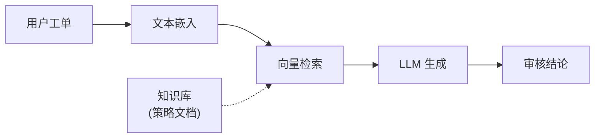
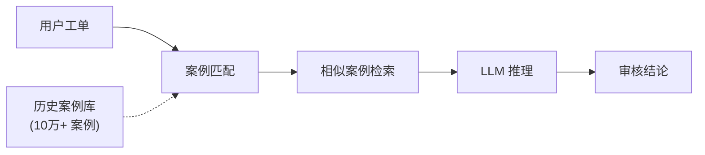
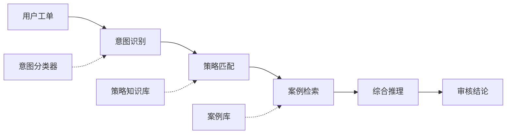
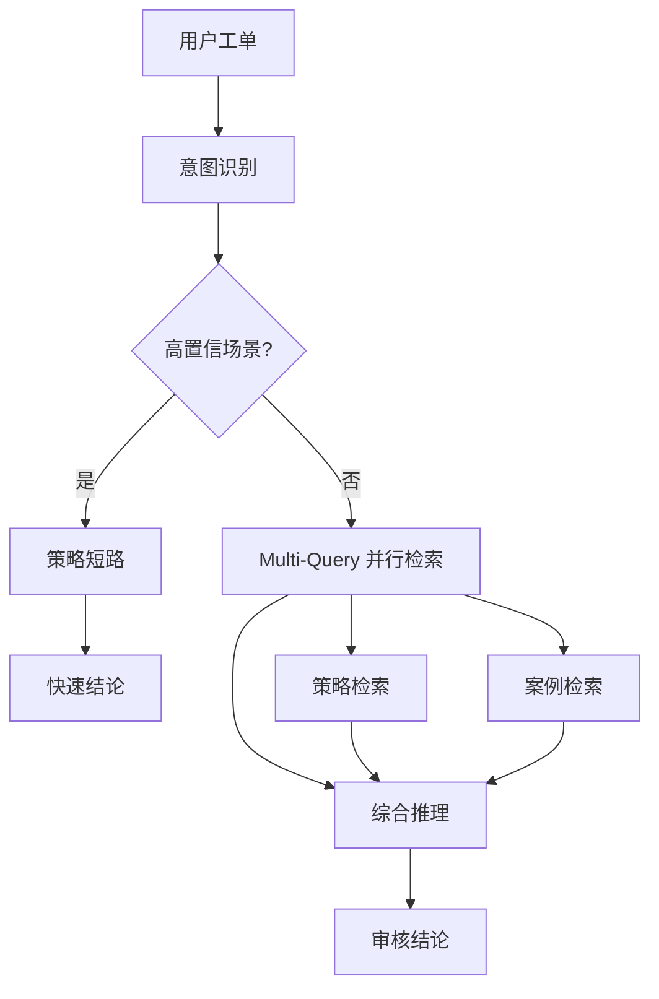

## 项目概述

风控审核大模型 AI Agent 是腾讯企业微信的核心智能审核系统，通过 V1→V4 的架构演进，将审核准确率从 70% 提升至 90%+，每日自动结单 300+ 单，节省 2+ 人力/天。

## 架构演进

### V1: 朴素 RAG (2025.12)



**问题**: 召回率低，复杂场景无法处理

---

### V2: CBR 案例推理 (2026.01)



**改进**: 引入历史案例，提升复杂场景处理能力

---

### V3: Prompt Chaining (2026.01)



**改进**: 多阶段推理，提升准确率

---

### V4: Multi-Query + 策略短路 (2026.02)



**核心创新**:
- **策略短路**: 高置信场景直接匹配策略，跳过复杂推理
- **Multi-Query**: 并行检索策略和案例，提升召回率 20%

## 技术亮点

### 策略短路机制

针对高频场景（如人脸解封），设计规则引擎直接匹配：

| 场景 | 短路前识别率 | 短路后识别率 |
|------|-------------|-------------|
| 人脸解封 | 5-10% | 94.89% |
| 账号申诉 | 30% | 85%+ |

### Multi-Query 并行检索

```python
# 伪代码示意
async def multi_query_retrieve(query):
    tasks = [
        retrieve_policies(query),      # 策略检索
        retrieve_cases(query),         # 案例检索
        retrieve_similar_tickets(query) # 相似工单
    ]
    results = await asyncio.gather(*tasks)
    return merge_and_rank(results)
```

### 可观测性工具链

- **Langfuse**: 全链路追踪，延迟/成本/准确率实时监控
- **RAGAS**: 自动化评估框架，持续优化 Prompt
- **Badcase 定位**: 失败案例自动归因，指导迭代

## 关键成果

| 指标 | V1 | V4 | 提升 |
|------|-----|-----|------|
| 准确率 | 70% | 90%+ | +20% |
| 日均自动结单 | 50 | 300+ | 6x |
| 人力节省 | - | 2+/天 | - |
| 并发支持 | 100 | 2000+ | 20x |

## 技术栈

- **推理框架**: Prompt Chaining + CBR
- **检索系统**: Multi-Query RAG
- **向量数据库**: Qdrant
- **监控**: Langfuse + RAGAS
- **后端**: Go + 分布式异步

