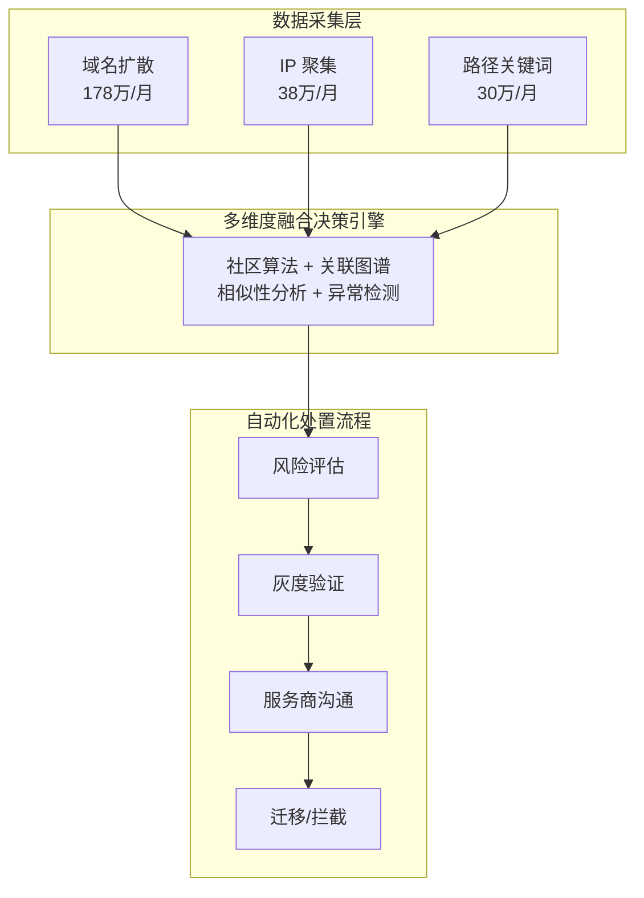
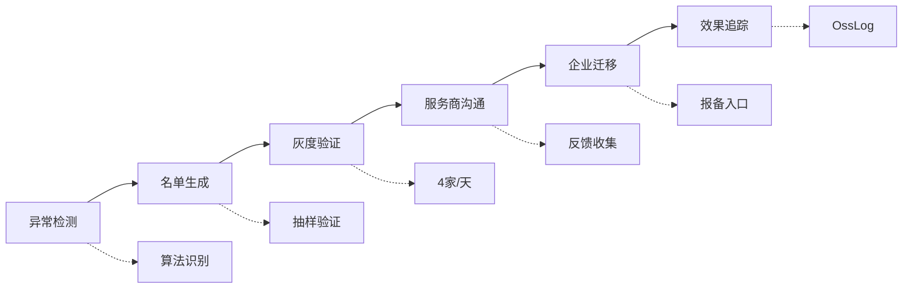

## 项目概述

自建应用反作弊治理项目是企业微信生态安全的核心治理系统，通过多维度算法识别违规服务商和企业，实现 30+ 模块的端到端自动化决策，年化收益超 300 万元。

## 系统架构



## 核心算法

### 1. 域名扩散算法

基于 trustedurllist、callbackurl、homepage 等字段的一级域名聚类：

| 筛选条件 | 阈值 |
|----------|------|
| 应用数 | ≥ 20 |
| 企业数 | ≥ 5 |
| 活跃人数 | ≥ 5/月 |
| 排除 | 政府/教育/代开发/上下游/集团 |

**成果**: 识别 276 服务商、6292 企业、16764 应用，月均收益 **178 万**

### 2. IP 聚集分析

基于 clientip 和 trustedip 的聚类分析：

```
IP 有效性规则:
├── 同一 IP 被同一应用、同一企业使用 5 天以上
├── 该 IP 被至少 20 个企业使用
└── 排除内网 IP 和秒拨 IP
```

**成果**: 识别 269 服务商、3572 企业、5448 应用，月均收益 **38 万**

### 3. 路径关键词聚集

基于 homepage 和 callback 的路径切词聚类：

| 规则 | 描述 |
|------|------|
| 切词 | 每个节点长度 2-12 字符 |
| 聚类 | 相同关键词路径的应用聚合 |
| 扩展 | 基于聚类结果向下钻取 |

**成果**: 识别 26 服务商、1387 企业、1965 应用，月均收益 **30 万**

### 4. 社区检测算法

融合多种社区检测算法进行关联分析：
- Label Propagation
- Louvain 模块度优化
- 图卷积网络特征传播

## 分期策略

| 期数 | 策略 | 状态 | 核心特征 |
|------|------|------|----------|
| 一期 | 相同/相似性分析 | ✅ 上线 | trustedurllist, callbackurl, appname |
| 二期 | 域名扩散 + IP 聚集 | ✅ 上线 | homepage, clientip, trustedip |
| 二期 | 路径关键词 | ✅ 上线 | path_key, callback_param |
| 三期 | 增量应用分析 | 规划中 | 应用创建人, 访问信息 |

## 自动化治理流程



**申诉机制**:
- 企业申诉：无明确证据先放过
- 服务商申诉：无明显误判维持拦截

## 关键成果

| 指标 | 数值 |
|------|------|
| 累计识别违规服务商 | 820+ 家 |
| 累计识别违规企业 | 52,683+ 家 |
| 月均收益 | 246 万 |
| 年化收益 | 300 万+ |
| 自动化决策模块 | 30+ |

### 收益分布

| 算法 | 月收益 | 占比 |
|------|--------|------|
| 域名扩散 | 178 万 | 72% |
| IP 聚集 | 38 万 | 15% |
| 路径关键词 | 30 万 | 13% |

