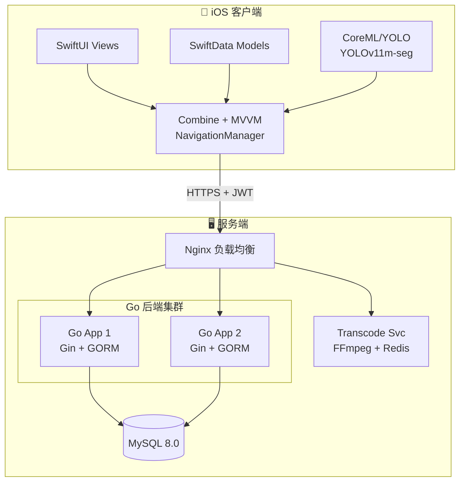
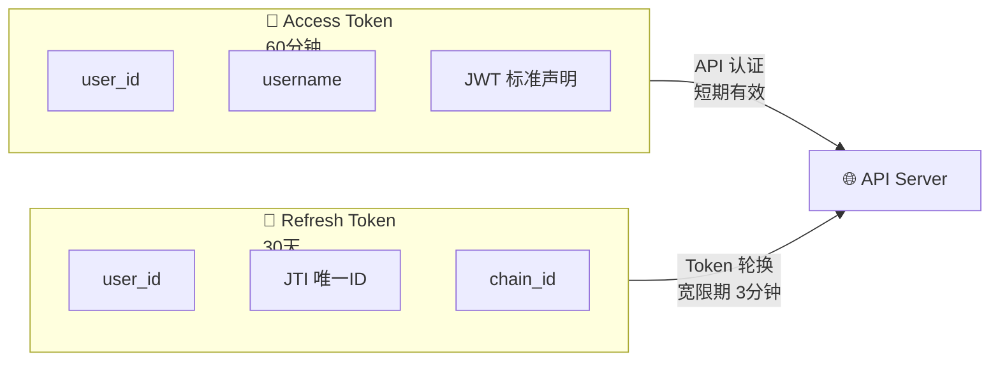

## 项目概述

磕线 (Betaline) 是一款专业的 iOS 攀岩指力训练应用，从 0 到 1 独立完成全流程开发：产品设计、UI/UX、iOS 前端、Go 后端、AI 模型训练、DevOps 运维。

## 系统架构

## 技术亮点

### 1. VideoMind Chain-of-Roles 工作流

设计 6 角色串联的视频分析工作流，实现攀岩视频智能分析：

| 角色 | 职责 | 输出 |
|------|------|------|
| Planner | 分析视频结构 | 关键时间点 |
| Grounder | 定位攀爬片段 | 起止时间戳 |
| Verifier | 验证边界精度 | ±0.5s 精度 |
| ColorAnalyzer | 识别岩点颜色 | 9 色分类 |
| ResultAnalyzer | 判断完攀状态 | 成功/失败 |
| Answerer | 生成结构化结果 | JSON 输出 |

**成果**: 成本优化 39%（¥1.5 → ¥0.9/视频），准确率 92%

### 2. YOLO 岩点检测模型

从零训练 YOLOv11m 实例分割模型：

- **数据工程**: VIA → YOLO 格式转换 + Detectron2 伪标签扩展
- **模型性能**: mAP50 59.18%，3 类检测 (hold/downpoint/volume)
- **部署优化**: 129MB → 43MB (INT8 量化)，CoreML 导出

### 3. MobileNet V3 轻量化分类器

替代 VLM 的轻量化方案：

| 指标 | VLM | MobileNet V3 |
|------|-----|--------------|
| 推理时间 | 30-60s | ~100ms |
| 成本 | ¥0.01/帧 | 免费 |
| 加速比 | 1x | 300x |

### 4. JWT 双令牌安全架构

**宽限期机制**: 解决高并发场景下的竞态条件

### 5. 自研 MCP Server

25 个运维工具实现 AI Agent 远程服务器控制：

- 服务状态查询与重启
- Nginx 配置检查与热重载
- Docker 容器管理
- Loki 日志查询
- 一键部署与回滚

## DevOps 架构

- **CI/CD**: GitHub Actions (8 个工作流，2400+ 行)
- **容器化**: Docker 多阶段构建 + 非 root 用户
- **负载均衡**: Nginx 轮询 + 健康检查 + 故障转移
- **监控**: Prometheus + Grafana + Loki
- **双仓库**: 腾讯云 TCR + GitHub Container Registry

## 关键指标

| 指标 | 数值 |
|------|------|
| 开发周期 | 6 个月 |
| 代码规模 | 30K+ LOC |
| API 端点 | 30+ |
| 服务可用性 | 99.9% |
| YOLO 推理 | 400-600ms |
| AI 加速比 | 300x |

