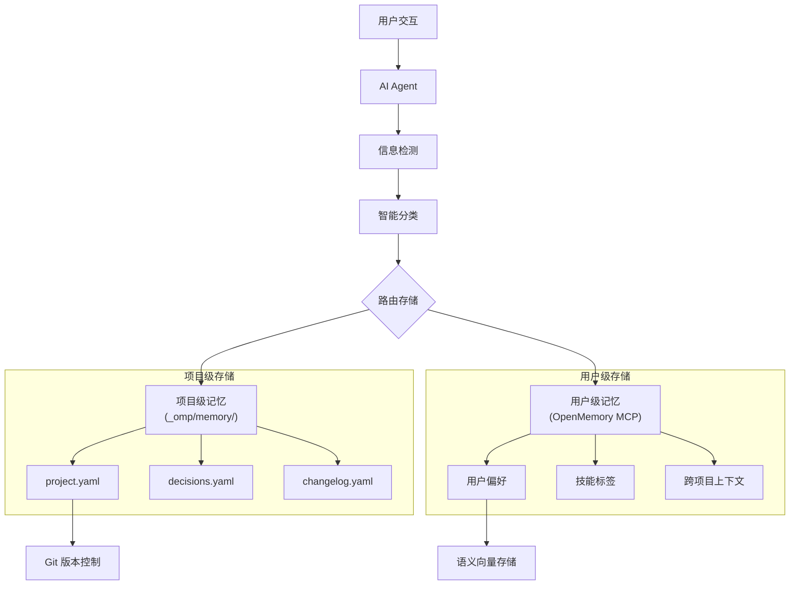

## 项目概述

OpenMemory Plus 是一个 AI Agent 双层记忆框架，解决 AI Agent 跨会话上下文丢失问题。支持 Augment、Cursor、Windsurf、Cline 等主流 IDE，实现跨会话上下文保持率 95%+。

## 核心架构

### 双层记忆模型



### 存储分层设计

| 层级 | 存储系统 | 生命周期 | 访问方式 |
|------|----------|----------|----------|
| **L1 项目级** | `_omp/memory/*.yaml` | 随项目 | 文件读取 |
| **L2 用户级** | OpenMemory MCP | 跨项目 | MCP 协议 |
| **L3 会话级** | `activeContext.md` | 单会话 | 内存/文件 |

## 技术亮点

### 1. ROT 智能过滤

减少 40% 冗余记忆，提升检索效率：

| 类型 | 检测条件 | 处理 |
|------|----------|------|
| **R**edundant | 语义相似度 > 0.85 | 合并或跳过 |
| **O**bsolete | 超过 TTL + 无访问 | 标记删除 |
| **T**rivial | 长度 < 10 字符 | 直接丢弃 |

### 2. 5 维度分类引擎

```yaml
dimensions:
  scope:
    PROJECT: "项目配置/技术决策/部署信息"
    PERSONAL: "用户偏好/技能/习惯"
    EPHEMERAL: "临时信息/一次性上下文"
  
  confidence:
    EXPLICIT: 1.0    # 用户明确说明
    INFERRED: 0.7    # 从行为推断
    UNCERTAIN: 0.4   # 不确定
  
  temporality:
    permanent: "永久保留"
    session: "会话级别"
    temporary: "临时/可丢弃"
```

### 3. Agent 自闭环测试体系

15 项端到端测试全自动化：

| 测试类型 | 覆盖场景 |
|----------|----------|
| 记忆写入 | 项目级/用户级路由 |
| 记忆读取 | 并行查询/上下文融合 |
| ROT 过滤 | 去重/过期/无效检测 |
| 降级恢复 | MCP 不可用时的降级策略 |
| 跨 IDE | Augment/Cursor/Windsurf/Cline |

### 4. 统一目录结构

```
_omp/                           # OpenMemory Plus 根目录
├── AGENTS.md                   # Agent 指令入口 (所有 IDE 共享)
├── commands/                   # 命令定义
│   └── memory.md               # /memory 命令
├── memory/                     # 项目级记忆存储
│   ├── project.yaml            # 项目配置 (SSOT)
│   ├── decisions.yaml          # 技术决策记录
│   └── activeContext.md        # 当前会话上下文
└── skills/                     # 扩展能力
    └── memory-extraction/      # 记忆提取 Skill
```

## 技术决策

| 决策点 | 选择 | 放弃方案 | 原因 |
|--------|------|----------|------|
| 存储格式 | YAML | JSON/TOML | 人类可读 + 支持注释 |
| 用户记忆 | MCP | 本地文件 | 跨项目 + 语义搜索 |
| 分类方式 | 规则 | ML 模型 | 可解释 + 低延迟 |
| 版本控制 | Git | 数据库 | 与代码同步 + 免费 |

## 降级策略

当 OpenMemory MCP 不可用时：

1. **检测**: MCP 调用超时 > 3s
2. **降级**: 用户级信息暂存 `_omp/memory/user-context.yaml`
3. **标记**: `_degraded: true`
4. **恢复**: MCP 可用后提示同步

## 关键成果

| 指标 | 数值 |
|------|------|
| 跨会话上下文保持率 | 95%+ |
| 冗余记忆减少 | 40% |
| E2E 测试覆盖 | 15 项 |
| 支持 IDE | 4+ |

