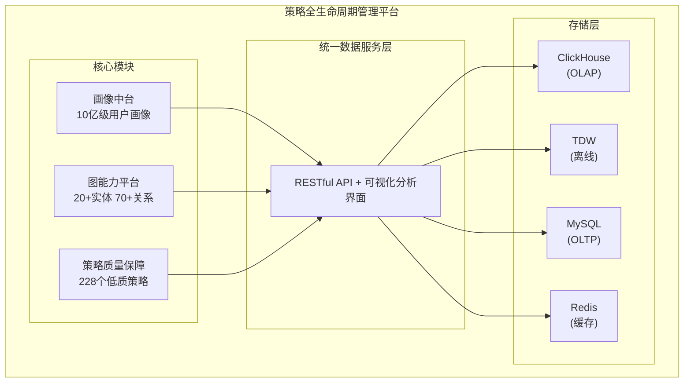

## 项目概述

策略全生命周期管理平台是腾讯企业微信的核心基础设施，整合画像中台、图能力、策略质量保障、特征系统的一站式策略管理平台，支撑 10 亿级用户规模的数据分析。

## 系统架构



## 核心模块

### 1. 画像中台 (10 亿级)

支持 200+ 标签维度的用户分析：

| 能力 | 描述 | 性能 |
|------|------|------|
| 标签计算 | 批处理 + 实时流处理 | 准实时更新 |
| 复杂分析 | 多维度交叉查询 | 5 分钟内完成 |
| 数据规模 | 10 亿级用户画像 | TB 级日处理 |

**业务成果**:
- 刷单欺诈 ↓30%
- 贷款投诉 ↓23%

### 2. 图数据库能力

构建企业关系图谱：

```
实体类型 (20+):
├── 企业 (Corp)
├── 用户 (User)
├── 应用 (App)
├── 服务商 (ServiceProvider)
├── IP 地址 (IP)
├── 域名 (Domain)
└── ...

关系类型 (70+):
├── 企业-用户 (雇佣关系)
├── 企业-应用 (使用关系)
├── 服务商-企业 (服务关系)
├── IP-应用 (部署关系)
└── ...
```

**分析能力**:
- 4 种扩散分析：域名扩散、IP 聚集、社区发现、关联挖掘
- 4 种溯源分析：路径追踪、关系链分析、时序分析、异常检测

### 3. 策略质量保障

自动化策略质量检测：

| 指标 | 优化前 | 优化后 |
|------|--------|--------|
| 低质量策略 | 未知 | 228 个 |
| 误封率 | 2.4% | 0% |

### 4. PKV 分布式序列化优化

修复核心性能缺陷：

```
写入性能: 90k/s → 1200w/s (130 倍提升)
```

**问题根因**: 分布式序列化协议设计缺陷
**解决方案**: 重新设计序列化协议，优化网络传输

## 技术栈

| 层级 | 技术 | 用途 |
|------|------|------|
| 分析引擎 | ClickHouse | OLAP 分析查询 |
| 离线计算 | TDW/Spark | 批处理计算 |
| 在线存储 | MySQL | 元数据/配置 |
| 缓存层 | Redis | 热点数据缓存 |
| 前端 | Vue.js | 可视化界面 |

## 关键成果

| 指标 | 数值 |
|------|------|
| 数据规模 | 10 亿级 |
| 标签维度 | 200+ |
| 查询响应 | P99 < 3s |
| 性能提升 | 130 倍 |
| 年化收益 | 4000 万+ |
